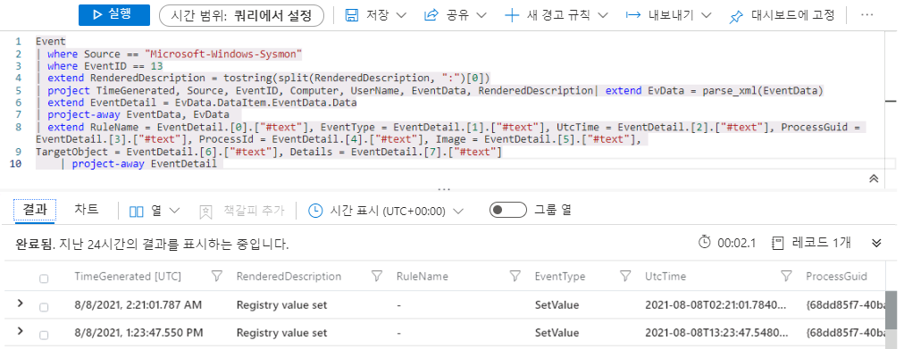
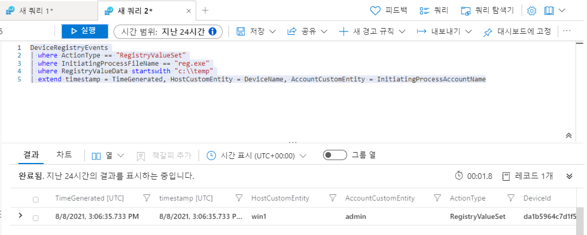
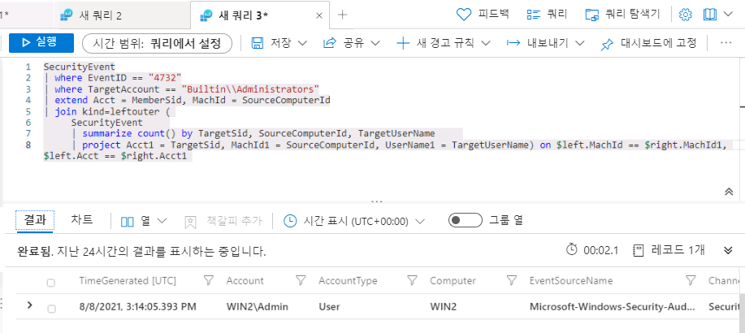

# 모듈 7 - 랩 1 - 연습 6 - 검색 만들기

### 작업 1: Sysmon을 사용하여 공격 1 검색

이 작업에서는 보안 이벤트 커넥터와 Sysmon이 설치된 호스트에서 공격 1 검색을 만듭니다.

이 공격은 시작 시에 실행되는 레지스트리 키를 만듭니다.  
```Command
REG ADD "HKCU\SOFTWARE\Microsoft\Windows\CurrentVersion\Run" /V "SOC Test" /t REG_SZ /F /D "C:\temp\startup.bat"
```

1. WIN1 가상 머신에 Admin으로 로그인합니다. 암호로는 **Pa55w.rd**를 사용합니다.  

2. Edge 브라우저에서 Azure Portal https://portal.azure.com으로 이동합니다.

3. 랩 호스팅 공급자가 제공한 관리자용 **테넌트 전자 메일** 계정을 복사하여 **로그인** 대화 상자에 붙여넣은 후 **다음**을 선택합니다.

4. 랩 호스팅 공급자가 제공한 관리자용 **테넌트 암호**를 복사하여 **암호 입력** 대화 상자에 붙여넣은 후 **로그인**을 선택합니다.

5. Azure Portal의 검색 창에 *Sentinel*을 입력하고 **Azure Sentinel**을 선택합니다.

6. 앞에서 만든 Azure Sentinel 작업 영역을 선택합니다.

7. 일반 섹션에서 **로그**를 선택합니다.

8. 먼저 데이터가 저장되는 위치를 확인해야 합니다. 방금 공격을 수행했으므로,  로그 시간 범위를 **지난 24시간**으로 설정합니다.

9. 다음 KQL 문을 실행합니다.

```KQL
search "temp\\startup.bat"
```

10. 결과에는 다음의 3개 테이블이 표시됩니다.
    - DeviceProcessEvents
    - DeviceRegistryEvents
    - Event

    *Device* 테이블은 엔드포인트용 Defender(데이터 커넥터 - Microsoft 365 Defender)에서 제공된 것입니다.  그리고 *Event* 테이블은 여기서 사용하는 데이터 커넥터 보안 이벤트에서 제공된 것입니다. 

    여기서는 Sysmon과 엔드포인트용 Defender의 두 원본에서 데이터를 수신하므로, 나중에 통합할 수 있는 KQL 문 두 개를 작성해야 합니다.  초기 조사에서 각 문을 개별적으로 살펴볼 예정입니다.

    **참고:** 드물게 데이터 로드 프로세스 시간이 평소보다 더 오래 걸리는 경우도 있을 수 있습니다.  그럴 경우 몇 시간 동안 테이블이 쿼리에 표시되지 않을 수 있습니다.

11. 첫 번째 데이터 원본은 Windows 호스트의 Sysmon입니다.  다음 KQL 문을 실행합니다.

```KQL
search in (Event) "temp\\startup.bat"
```
이제 결과에는 Event 테이블만 표시됩니다.  

12. 행을 확장하여 레코드와 관련된 모든 열을 표시합니다.  EventData, ParameterXml 등의 일부 필드에는 여러 데이터 항목이 구조화된 데이터로 저장되어 있습니다.  그러므로 특정 필드를 쿼리하기가 어렵습니다.  

13. 따라서 다음으로는 의미 있는 필드를 찾을 수 있도록 각 행의 데이터를 구문 분석하는 KQL 문을 작성해야 합니다.  GitHub의 Azure Sentinel 커뮤니티 내 Parsers 폴더에는 다양한 파서 예제가 포함되어 있습니다.  브라우저에서 다른 탭을 열고 다음 위치로 이동합니다. **https://github.com/Azure/Azure-Sentinel**

14. **Parsers** 폴더와 **Sysmon** 폴더를 차례로 선택합니다.  그러면 다음 파일이 표시됩니다. Azure-Sentinel/Parsers/Sysmon/Sysmon-v12.0.txt

15. Sysmon-v12.0.txt 파일을 선택하여 표시합니다.

파일 맨 위에 Event 테이블을 쿼리하여 EventData 변수에 저장하는 let 문이 있습니다.


```KQL
let EventData = Event
| where Source == "Microsoft-Windows-Sysmon"
| extend RenderedDescription = tostring(split(RenderedDescription, ":")[0])
| project TimeGenerated, Source, EventID, Computer, UserName, EventData, RenderedDescription
| extend EvData = parse_xml(EventData)
| extend EventDetail = EvData.DataItem.EventData.Data
| project-away EventData, EvData  ;
```

파일 아래쪽에는 EventData 변수를 입력으로 사용하여 EventID == 13을 찾는 또 다른 let 문이 있습니다.  

```KQL
let SYSMON_REG_SETVALUE_13=()
{
    let processEvents = EventData
    | where EventID == 13
    | extend RuleName = EventDetail.[0].["#text"], EventType = EventDetail.[1].["#text"], UtcTime = EventDetail.[2].["#text"], ProcessGuid = EventDetail.[3].["#text"], 
    ProcessId = EventDetail.[4].["#text"], Image = EventDetail.[5].["#text"], TargetObject = EventDetail.[6].["#text"], Details = EventDetail.[7].["#text"]
    | project-away EventDetail  ;
    processEvents;
    
};
```
이 예제를 참조하여 KQL 문을 작성할 수 있습니다.

16. 여기서는 위의 문을 사용하여 모든 Registry Key Set Value 행을 표시하는 KQL 문을 직접 작성합니다.  다음 KQL 쿼리를 실행합니다.

```KQL

Event
| where Source == "Microsoft-Windows-Sysmon"
| where EventID == 13
| extend RenderedDescription = tostring(split(RenderedDescription, ":")[0])
| project TimeGenerated, Source, EventID, Computer, UserName, EventData, RenderedDescription
| extend EvData = parse_xml(EventData)
| extend EventDetail = EvData.DataItem.EventData.Data
| project-away EventData, EvData  
| extend RuleName = EventDetail.[0].["#text"], EventType = EventDetail.[1].["#text"], UtcTime = EventDetail.[2].["#text"], ProcessGuid = EventDetail.[3].["#text"], 
    ProcessId = EventDetail.[4].["#text"], Image = EventDetail.[5].["#text"], TargetObject = EventDetail.[6].["#text"], Details = EventDetail.[7].["#text"]
    | project-away EventDetail 


```

   

17.  검색 규칙을 계속 작성할 수도 있지만, 이 KQL 문을 다른 검색 규칙의 KQL 문에 이 KQL 문을 재사용할 수 있을 것으로 보입니다.  로그 창에서 **저장**, **함수로 저장**을 차례로 선택합니다. 저장 플라이아웃에서 다음을 입력하고 함수를 저장합니다.

함수 이름: Event_Reg_SetValue
범주: Sysmon


18. 새 로그 쿼리 탭을 엽니다. 해당 탭에서 다음 KQL 문을 실행합니다.

```KQL

Event_Reg_SetValue

```
현재 데이터 컬렉션에 따라 행이 여러 개 반환될 수도 있습니다.  정상적인 현상이므로 무시하세요.  다음 작업에서 이 랩의 시나리오에 맞게 결과를 필터링합니다.

19. 다음 KQL 문을 실행합니다.

```KQL

Event_Reg_SetValue | search "startup.bat"

```
그러면 필요한 레코드가 반환됩니다. 이제 해당 레코드의 데이터를 검토하여 행 식별을 위해 변경 가능한 부분을 확인할 수 있습니다.

20. 이 예제의 위협 인텔리전스에서는 위협 행위자가 reg.exe를 사용하여 레지스트리 키를 추가한다는 것이 확인되었습니다.  레지스트리 키가 추가된 디렉터리는 c:\temp입니다. startup.bat는 다른 이름일 수도 있습니다. 다음 스크립트를 실행합니다.

```KQL
Event_Reg_SetValue 
| where Image contains "reg.exe"

```
이제 식별할 파일이 지정되었습니다.  다음으로는 c:\temp에서만 결과가 반환되도록 지정해야 합니다.

21. 이제 다음 KQL 문을 실행합니다.

```KQL
Event_Reg_SetValue 
| where Image contains "reg.exe"
| where Details startswith "C:\\TEMP"
```

이제 적절한 검색 규칙이 작성되었습니다.  

22. 보안 운영 분석자가 위협을 정확하게 분석할 수 있도록 경고 관련 상황 정보를 최대한 많이 제공해야 합니다. 가령 조사 그래프에 사용할 엔터티 등을 제공할 수 있습니다.  다음 쿼리를 실행합니다.

```KQL
Event_Reg_SetValue 
| where Image contains "reg.exe"
| where Details startswith "C:\\TEMP"
| extend timestamp = TimeGenerated, HostCustomEntity = Computer, AccountCustomEntity = UserName

```

23. 이제 적절한 검색 규칙이 작성되었으므로 쿼리가 있는 로그 창의 명령 모음에서 **+ 새 경고 규칙**을 선택하고 **Azure Sentinel 경고 만들기**를 선택합니다.

24. 그러면 분석 규칙 마법사가 시작됩니다.  일반 탭에서 다음 정보를 입력합니다.

    이름: Sysmon Startup RegKey

    설명: c:\temp의 Sysmon Startup RegKey

    전술: 지속성

    심각도: 높음

**다음: 규칙 논리 설정 >** 을 선택합니다.

25. **규칙 논리 설정** 탭에서 **규칙 쿼리**에는 내용이 이미 입력되어 있습니다.

26. 쿼리 예약에서 다음 항목을 설정합니다.

- 쿼리 실행 간격: 5분
- 데이터를 확인할 기간: 1일

**참고** 여기서는 같은 데이터에 대해 의도적으로 여러 인시던트를 생성합니다.  그러면 랩에서 해당 경고를 사용할 수 있기 때문입니다.

27. 나머지 옵션은 기본값으로 둡니다.  **다음: 인시던트 설정 >** 단추를 클릭합니다.

28. 인시던트 설정에서 다음 항목을 설정합니다. 

- 인시던트 설정: 사용
- 경고 그룹: 사용 안 함

**다음: 자동화된 응답 >** 단추를 클릭합니다.

29. 자동화된 응답 탭에서 다음 항목을 설정합니다.

- *PostMessageTeams-OnAlert*을 선택합니다.

**다음: 검토** 단추를 선택합니다.

30. 검토 탭에서 **만들기** 단추를 선택합니다.


### 작업 2: 엔드포인트용 Defender를 사용하여 공격 1 검색

이 작업에서는 엔드포인트용 Defender가 구성되어 있는 호스트에서 공격 1 검색을 만듭니다.

이 공격은 시작 시에 실행되는 레지스트리 키를 만듭니다.  
```Command
REG ADD "HKCU\SOFTWARE\Microsoft\Windows\CurrentVersion\Run" /V "SOC Test" /t REG_SZ /F /D "C:\temp\startup.bat"
```

1. Azure Sentinel 포털의 일반 섹션에서 **로그**를 선택합니다.

2. 먼저 데이터가 저장되는 위치를 확인해야 합니다. 방금 공격을 수행했으므로,  

    로그 시간 범위를 지난 24시간으로 설정합니다.

3. 다음 KQL 문을 실행합니다.

```KQL
search "temp\\startup.bat"
```

4. 결과에는 다음의 3개 테이블이 표시됩니다.
    DeviceProcessEvents
    DeviceRegistryEvents
    Event

    Device* 테이블은 엔드포인트용 Defender(데이터 커넥터 - Microsoft 365 Defender)에서 제공된 것입니다.  그리고 Event 테이블은 여기서 사용하는 데이터 커넥터 보안 이벤트에서 제공된 것입니다. 

    여기서는 Sysmon과 엔드포인트용 Defender의 두 원본에서 데이터를 수신하므로,  나중에 통합할 수 있는 KQL 문 두 개를 작성해야 합니다.  초기 조사에서 각 문을 개별적으로 살펴볼 예정입니다.

5. 이 검색에서는 엔드포인트용 Defender의 데이터를 중점적으로 찾습니다.  다음 KQL 문을 실행합니다.

```KQL
search in (Device*) "temp\\startup.bat"
```

6. 이미 일반화되어 쉽게 쿼리할 수 있는 데이터는 DeviceRegistryEvents 테이블에 포함되어 있는 것으로 보입니다.  행을 확장하여 레코드와 관련된 모든 열을 표시합니다.

7. 이 예제의 위협 인텔리전스에서는 위협 행위자가 reg.exe를 사용하여 레지스트리 키를 추가한다는 것이 확인되었습니다.  레지스트리 키가 추가된 디렉터리는 c:\temp입니다. startup.bat는 다른 이름일 수도 있습니다.  다음 KQL 문을 입력합니다.

```KQL

DeviceRegistryEvents
| where ActionType == "RegistryValueSet"
| where InitiatingProcessFileName == "reg.exe"
| where RegistryValueData startswith "c:\\temp"


```

이제 적절한 검색 규칙이 작성되었습니다.  

8. 보안 운영 센터 분석자가 위협을 정확하게 분석할 수 있도록 경고 관련 상황 정보를 최대한 많이 제공해야 합니다. 가령 조사 그래프에 사용할 엔터티 등을 제공할 수 있습니다. 다음 쿼리를 실행합니다.

```KQL
DeviceRegistryEvents
| where ActionType == "RegistryValueSet"
| where InitiatingProcessFileName == "reg.exe"
| where RegistryValueData startswith "c:\\temp"
| extend timestamp = TimeGenerated, HostCustomEntity = DeviceName, AccountCustomEntity = InitiatingProcessAccountName


```

   

9.  이제 적절한 검색 규칙이 작성되었으므로 쿼리가 있는 로그 창의 명령 모음에서 **+ 새 경고 규칙**을 선택합니다.  **Azure Sentinel 경고 만들기**를 선택합니다.

10. 그러면 분석 규칙 마법사가 시작됩니다.  일반 탭에서 다음 정보를 입력합니다.


    이름: D4E Startup RegKey

    설명: c:\temp의 D4E Startup Regkey

    전술: 지속성

    심각도: 높음

11. **다음: 규칙 논리 설정 >** 단추를 선택합니다.

12. 규칙 논리 설정 탭에서 **규칙 쿼리**에는 내용이 이미 입력되어 있습니다.

13. 쿼리 예약에서 다음 항목을 설정합니다.

- 쿼리 실행 간격: 5분
- 데이터를 확인할 기간: 1일

**참고** 여기서는 같은 데이터에 대해 의도적으로 여러 인시던트를 생성합니다.  그러면 랩에서 해당 경고를 사용할 수 있기 때문입니다.

14. 나머지 옵션은 기본값으로 둡니다.  **다음: 인시던트 설정**을 선택하고

15. 인시던트 설정에서 다음 항목을 설정합니다. 

- 인시던트 설정: 사용
- 경고 그룹: 사용 안 함

**다음: 자동화된 응답 >** 을 선택하고

16. 자동화된 응답 탭에서 다음 항목을 설정합니다.

- PostMessageTeams-OnAlert을 선택합니다.
- **다음: 검토**를 선택합니다.

17. 검토 및 만들기 탭에서 **만들기**를 선택합니다.

### 작업 3: SecurityEvent를 사용하여 공격 2 검색

이 작업에서는 보안 이벤트 커넥터와 Sysmon이 설치된 호스트에서 공격 2 검색을 만듭니다.

이 공격은 새 사용자를 만들어 로컬 관리자에 추가합니다.
```Command
net user theusernametoadd /add
net user theusernametoadd ThePassword1!
net localgroup administrators theusernametoadd /add
```

1. Azure Sentinel 포털의 일반 섹션에서 **로그**를 선택합니다.

2. 먼저 데이터가 저장되는 위치를 확인해야 합니다. 방금 공격을 수행했으므로,  

    로그 시간 범위를 지난 24시간으로 설정합니다.

3. 다음 KQL 문을 실행합니다.

```KQL
search "administrators"
```

4. 결과에는 다음 테이블이 표시됩니다.
    Event
    SecurityEvent

5. 첫 번째 데이터 원본은 SecurityEvent입니다. Windows에서 권한 있는 그룹에 구성원을 추가하는 작업을 식별하는 데 사용하는 이벤트 ID를 조사해야 합니다.  여기서 해당 정보는 다음 EventID 및 Event입니다.

4732 - 구성원을 보안된 로컬 그룹에 추가했습니다.

다음 스크립트를 실행합니다.

```KQL
SecurityEvent
| where EventID == "4732"
| where TargetAccount == "Builtin\\Administrators"

```

6. 행을 확장하여 레코드와 관련된 모든 열을 표시합니다.  그런데 찾으려는 사용자 이름은 표시되지 않습니다.  사용자 이름이 저장되는 대신 SID(보안 식별자)가 저장되기 때문입니다.  다음 KQL은 SID 일치 여부를 확인하여 Administrators 그룹에 추가된 TargetUserName을 열에 입력합니다.


```KQL
SecurityEvent
| where EventID == "4732"
| where TargetAccount == "Builtin\\Administrators"
| extend Acct = MemberSid, MachId = SourceComputerId 
| join kind=leftouter (
     SecurityEvent 
     | summarize count() by TargetSid, SourceComputerId, TargetUserName
     | project Acct1 = TargetSid, MachId1 = SourceComputerId, UserName1 = TargetUserName
) on $left.MachId == $right.MachId1, $left.Acct == $right.Acct1 

```
이제 적절한 검색 규칙이 작성되었습니다.  

   

**참고:** 랩에서는 사용되는 데이터 세트가 작아서 이 KQL이 적절한 결과를 반환하지 않을 수도 있습니다.

7. 보안 운영 분석자가 위협을 정확하게 분석할 수 있도록 경고 관련 상황 정보를 최대한 많이 제공해야 합니다. 가령 조사 그래프에 사용할 엔터티 등을 제공할 수 있습니다.  다음 쿼리를 실행합니다.


```KQL
SecurityEvent
| where EventID == "4732"
| where TargetAccount == "Builtin\\Administrators"
| extend Acct = MemberSid, MachId = SourceComputerId 
| join kind=leftouter (
     SecurityEvent 
     | summarize count() by TargetSid, SourceComputerId, TargetUserName
     | project Acct1 = TargetSid, MachId1 = SourceComputerId, UserName1 = TargetUserName
) on $left.MachId == $right.MachId1, $left.Acct == $right.Acct1 
| extend timestamp = TimeGenerated, HostCustomEntity = Computer, AccountCustomEntity = UserName1

```

8. 이제 적절한 검색 규칙이 작성되었으므로 쿼리가 있는 로그 창의 명령 모음에서 **+ 새 경고 규칙**을 선택하고 **Azure Sentinel 경고 만들기**를 선택합니다.

9. 그러면 분석 규칙 마법사가 시작됩니다.  일반 탭에서 다음 정보를 입력합니다.

- 이름: SecurityEvents Local Administrators User Add 
- 설명: SecurityEvents Local Administrators User Add 
- 전술: 권한 에스컬레이션
- 심각도: 높음

**다음: 규칙 논리 설정 >** 단추를 선택합니다.

10. 규칙 논리 설정 탭의 규칙 쿼리 및 엔터티 매핑에는 내용이 이미 입력되어 있습니다.

11. 쿼리 예약에서 다음 항목을 설정합니다.

- 쿼리 실행 간격: 5분
- 데이터를 확인할 기간: 1일

**참고** 여기서는 같은 데이터에 대해 의도적으로 여러 인시던트를 생성합니다.  그러면 랩에서 해당 경고를 사용할 수 있기 때문입니다.

12. 나머지 옵션은 기본값으로 둡니다.  **다음: 인시던트 설정**을 선택하고

13. 인시던트 설정에서 다음 항목을 설정합니다.

- 인시던트 설정: 사용
- 경고 그룹: 사용 안 함
- **다음: 자동화된 응답 >을 선택하고**

14. 자동화된 응답 탭에서 다음 항목을 설정합니다.

- **PostMessageTeams-OnAlert**을 선택합니다.
- **다음: 검토 >** 단추를 선택합니다.

15. 검토 탭에서 **만들기**를 선택합니다.

## 연습 7 계속 진행
